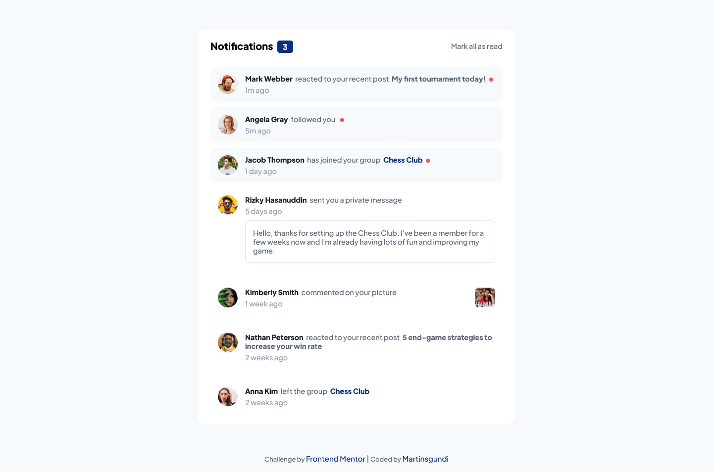
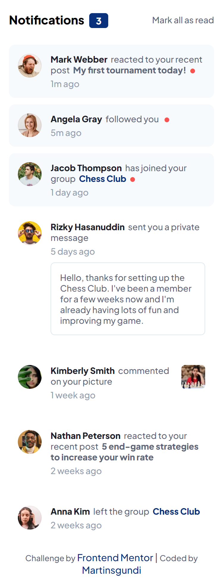

# Frontend Mentor - Notifications page solution

This is a solution to the [Notifications page challenge on Frontend Mentor](https://www.frontendmentor.io/challenges/notifications-page-DqK5QAmKbC). Frontend Mentor challenges help you improve your coding skills by building realistic projects. 

## Table of contents

- [Overview](#overview)
  - [The challenge](#the-challenge)
  - [Screenshot](#screenshot)
  - [Links](#links)
- [My process](#my-process)
  - [Built with](#built-with)
  - [What I learned](#what-i-learned)
  - [Continued development](#continued-development)
- [Author](#author)


## Overview

### The challenge

Users should be able to:

- Distinguish between "unread" and "read" notifications
- Select "Mark all as read" to toggle the visual state of the unread notifications and set the number of unread messages to zero
- View the optimal layout for the interface depending on their device's screen size
- See hover and focus states for all interactive elements on the page

### Screenshot








### Links

- Solution URL: [Add solution URL here](https://your-solution-url.com)
- Live Site URL: [Add live site URL here](https://your-live-site-url.com)

## My process

### Built with

- Semantic HTML5 markup
- CSS custom properties
- Flexbox
- CSS Grid
- Mobile-first workflow
- Vanilla Js


### What I learned

This project helped me to practise and strengthen my javaScript skill. I learnt a new way of toggling textContent in the DOM without using If/Else statements. By declaring a variable that held an array of different values(textContent), I also declared a contentIndex variable to keep track of the current index in the array. Each time the Toggle button is clicked, the contentIndex is incremented, and the modulo operator (%) is used to loop back to the beginning of the array when reaching the end. 

Here is a snippet of the code:

```js
const toggleBtn = document.querySelector(".mark-as-read");

const toggleBtnArray = [
  "Mark all as read",
  "Undo",
];

let toggleBtnIndex = 0;

toggleBtn.addEventListener("click", () => {
   
    toggleBtn.style.opacity = "0"; // Fade out

    setTimeout(() => {
        toggleBtnIndex = (toggleBtnIndex + 1) % toggleBtnArray.length; // Iterates through the array
        toggleBtn.textContent = toggleBtnArray[toggleBtnIndex]; // Interhanges the textContents available in the array
        toggleBtn.style.opacity = "1"; // Fade in
    }, 300); // Delay to match the transition duration(300 = 0.3s)

    // Invoking other functions
    toggleUnreadNotifications();
    toggleRedDot();
    toggleNoOfUnread();
});
```

### Continued development
There's a lot of new things to learn especially in javaScript, so I will continue to get my hands dirty by carrying out different projects.


## Author

- Linkedin - [Martins Ogundipe](https://www.linkedin.com/in/martinsgundi)
- Frontend Mentor - [Martinsgundi](https://www.frontendmentor.io/profile/Martinsgundi)
- Twitter - [Martinsgundi1](https://www.twitter.com/martinsgundi1)